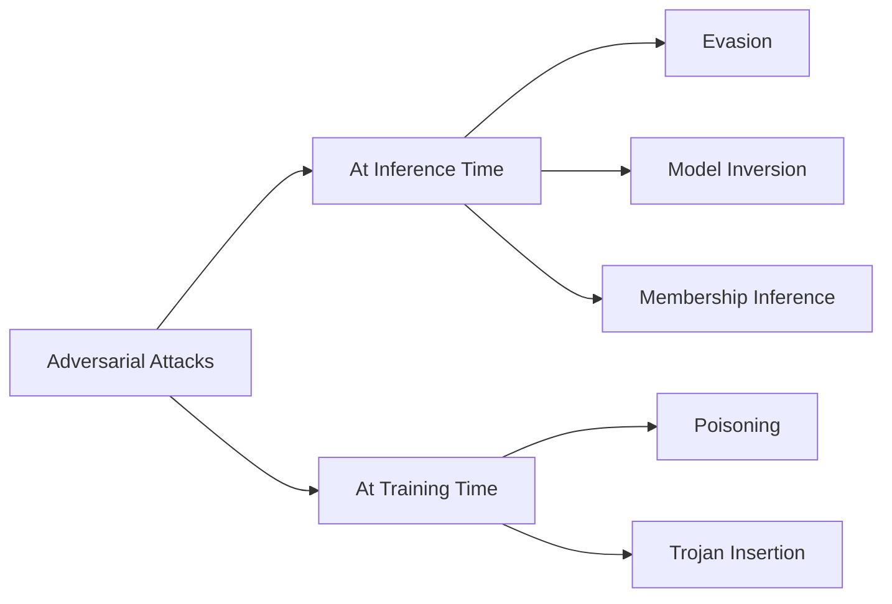

# AI & Machine Learning Security Specialist Guide

[](https://github.com/yourusername/AI-Machine-Learning-Security-Specialist)
[](https://github.com/yourusername/AI-Machine-Learning-Security-Specialist)
[](https://github.com/yourusername/AI-Machine-Learning-Security-Specialist)
[](https://github.com/yourusername/AI-Machine-Learning-Security-Specialist)
[](https://yourusername.github.io/AI-Machine-Learning-Security-Specialist)
[](https://github.com/yourusername/AI-Machine-Learning-Security-Specialist)

> **Comprehensive Guide to Becoming an AI & Machine Learning Security Specialist - From Fundamentals to Advanced Techniques**

Welcome to the definitive guide for becoming an AI & Machine Learning Security Specialist. This repository contains everything you need to know to enter this high-demand field that commands salaries exceeding $100K. With our structured 12-month learning path, interactive website, and comprehensive resources, you'll be well-equipped to start or advance your career in this lucrative field.

## 🎯 Why AI Security?

As artificial intelligence becomes increasingly integrated into critical systems, the need for professionals who can secure these systems has never been greater. AI Security Specialists are among the most sought-after professionals in the tech industry.

### Key Benefits:
- **High Demand**: Limited professionals with this specialized skill set
- **Lucrative Salaries**: Average starting at $100K+, with experienced professionals earning $150K+
- **Future-Proof Career**: Combines cutting-edge AI with essential cybersecurity expertise
- **Diverse Applications**: Healthcare, finance, autonomous vehicles, and more

## 🌐 Live Demo

Check out the live version of this guide at: [https://yourusername.github.io/AI-Machine-Learning-Security-Specialist](https://yourusername.github.io/AI-Machine-Learning-Security-Specialist)

## 🔧 Detailed Learning Path

Our comprehensive 12-month roadmap takes you from beginner to job-ready:

### Phase 1: Foundations (Months 1-3)
- Mathematics for ML (Linear Algebra, Calculus, Statistics)
- Programming (Python, R)
- Basic Machine Learning Algorithms
- Introduction to Cybersecurity Principles

### Phase 2: Core ML & Security (Months 4-6)
- Deep Learning Frameworks (TensorFlow, PyTorch)
- Neural Network Architectures
- Common ML Vulnerabilities
- Data Privacy & Protection

### Phase 3: Adversarial ML (Months 7-9)
- Adversarial Attacks & Defenses
- Model Inversion & Membership Inference
- Fairness, Accountability & Transparency
- Secure Model Training

### Phase 4: Professional Application (Months 10-12)
- Industry-Specific Applications
- Security Framework Implementation
- Ethical Considerations
- Capstone Project & Portfolio

## 📚 Core Learning Modules

### 1. Mathematical Foundations
Essential mathematics for understanding machine learning algorithms and security principles:
- Linear Algebra
- Probability & Statistics
- Calculus
- Optimization Theory

### 2. Programming & Tools
Master the programming languages and tools essential for AI security:
- Python for ML & Security
- R for Statistical Analysis
- Jupyter Notebooks
- Git & Version Control

### 3. Machine Learning Fundamentals
Understanding core ML algorithms and their security implications:
- Supervised Learning
- Unsupervised Learning
- Reinforcement Learning
- Neural Networks Basics

### 4. Cybersecurity Principles
Foundational cybersecurity knowledge critical for protecting AI systems:
- Threat Modeling
- Cryptography Basics
- Network Security
- Incident Response

### 5. Adversarial Machine Learning
Specialized techniques for attacking and defending ML systems:
- Evasion Attacks
- Poisoning Attacks
- Model Extraction
- Defense Mechanisms

### 6. Privacy-Preserving ML
Techniques for protecting data privacy in ML systems:
- Differential Privacy
- Federated Learning
- Homomorphic Encryption
- Secure Multi-party Computation

## 📊 Conceptual Diagrams

### AI Security Landscape
``mermaid
graph TD
A[AI System] --> B[Data Security]
A --> C[Model Security]
A --> D[Inference Security]
B --> E[Data Poisoning]
B --> F[Privacy Leakage]
C --> G[Model Theft]
C --> H[Backdoor Attacks]
D --> I[Evasion Attacks]
D --> J[Model Inversion]
```

### Adversarial ML Attack Types


### Defense Strategies Pipeline
``mermaid
graph TB
A[Input Validation] --> B[Preprocessing Defenses]
B --> C[Robust Training]
C --> D[Detection Mechanisms]
D --> E[Verification Methods]
E --> F[Runtime Monitoring]
```

## 🛠️ Essential Resources

### Books
- "Adversarial Machine Learning" - Yevgeniy Vorobeychik
- "Machine Learning Security" - Battista Biggio
- "Privacy-Preserving Machine Learning" - Aurélien Bellet
- "AI Security and Privacy" - Zhiyong Wu

### Online Courses
- [Coursera: AI Security Specialization](https://www.coursera.org/specializations/ai-security)
- [edX: Cybersecurity for AI Systems](https://www.edx.org/learn/cybersecurity/artificial-intelligence-security)
- [Udacity: Secure AI Nanodegree](https://www.udacity.com/course/secure-ai-nanodegree--nd000)
- [MIT OpenCourseWare: AI Ethics & Security](https://ocw.mit.edu/courses/electrical-engineering-and-computer-science/)

### Tools & Frameworks
- [Adversarial Robustness Toolbox (ART)](https://github.com/Trusted-AI/adversarial-robustness-toolbox) - Python library for machine learning security
- [Foolbox](https://github.com/bethgelab/foolbox) - Python toolbox for adversarial examples
- [CleverHans](https://github.com/cleverhans-lab/cleverhans) - Adversarial examples library
- [PySyft](https://github.com/OpenMined/PySyft) - Private Deep Learning library

### Research Papers
- [arXiv: Adversarial Examples in ML](https://arxiv.org/search/?search_query=adversarial+examples&searchtype=all)
- [NIPS: Robustness in Deep Learning](https://papers.nips.cc/search/?q=robustness)
- [IEEE S&P: Privacy-Preserving ML](https://www.ieee-security.org/TC/SP2023/)
- [ACM CCS: Secure ML Systems](https://www.sigsac.org/ccs/CCS2023/)

## 🏆 Professional Certifications

| Certification | Focus | Duration | Average Salary | Link |
|---------------|-------|----------|----------------|------|
| Certified AI Security Specialist (CAIS) | Comprehensive AI security | 6 months | $120,000+ | [More Info](https://www.isc2.org/Certifications/CAIS) |
| Machine Learning Security Professional (MLSP) | Adversarial ML & defense | 4 months | $115,000+ | [More Info](https://www.mlsp.org) |
| Certified Information Systems Security Professional (CISSP) | Cybersecurity foundation | 8 months | $130,000+ | [More Info](https://www.isc2.org/Certifications/CISSP) |
| Google Professional ML Engineer | Secure ML pipeline | 3 months | $140,000+ | [More Info](https://cloud.google.com/certification/machine-learning-engineer) |

## 💼 Career Path & Salary Progression

### Entry Level (0-2 years)
- **Roles**: Junior AI Security Analyst, ML Security Intern
- **Salary Range**: $70,000 - $90,000
- **Responsibilities**: Vulnerability assessment, basic threat modeling

### Mid-Level (3-5 years)
- **Roles**: AI Security Engineer, ML Security Specialist
- **Salary Range**: $95,000 - $125,000
- **Responsibilities**: Defense mechanism implementation, attack simulation

### Senior Level (6+ years)
- **Roles**: Lead AI Security Architect, Principal ML Security Researcher
- **Salary Range**: $130,000 - $180,000+
- **Responsibilities**: Security framework design, research leadership

## 🚀 Getting Started

1. **Clone this repository**:
   ```bash
   git clone https://github.com/yourusername/AI-Machine-Learning-Security-Specialist.git
   ```

2. **Open the index.html file** in your browser to view the complete guide

3. **Follow the roadmap** from Phase 1 to Phase 4

4. **Complete hands-on projects** in each module

5. **Build your portfolio** with real-world security implementations

## 📁 Repository Structure

```
AI-Machine-Learning-Security-Specialist/
├── index.html                 # Main interactive website
├── styles.css                 # Styling for the website
├── script.js                  # Interactive JavaScript features
├── README.md                  # This file
├── LEARNING_PATH.md           # Detailed 12-month learning roadmap
├── SUMMARY.md                 # Project summary
├── PROJECT_OVERVIEW.md        # Complete project overview
├── DEPLOYMENT.md              # GitHub Pages deployment guide
├── _config.yml                # GitHub Pages configuration
├── CNAME                      # Custom domain configuration
├── 404.html                   # Custom error page
├── LICENSE                    # MIT License
└── resources/
    ├── TOOLS_COMPARISON.md    # Detailed AI security tools comparison
    └── CAREER_ROADMAP.md      # Comprehensive career progression guide
```

## 🤝 Contributing

Contributions are welcome! Please feel free to submit a Pull Request.

1. Fork the repository
2. Create your feature branch (`git checkout -b feature/AmazingFeature`)
3. Commit your changes (`git commit -m 'Add some AmazingFeature'`)
4. Push to the branch (`git push origin feature/AmazingFeature`)
5. Open a Pull Request

## 📧 Contact

Anand Binu Arjun - [@your_twitter](https://twitter.com/yourusername) - [anandbinuarjun@zohomail.eu](mailto:anandbinuarjun@zohomail.eu)

Project Link: [https://github.com/yourusername/AI-Machine-Learning-Security-Specialist](https://github.com/yourusername/AI-Machine-Learning-Security-Specialist)

## 📄 License

This project is licensed under the MIT License - see the [LICENSE](LICENSE) file for details.

---
<p align="center">
  Made with ❤️ by Anand Binu Arjun | <a href="https://anandbinuarjun.live">anandbinuarjun.live</a>
</p>