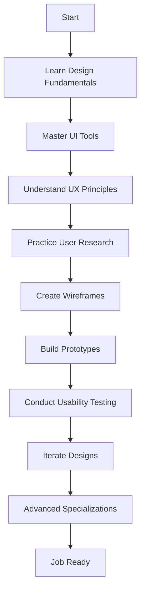

# UI/UX Developer Guide: From Basics to Advanced

A comprehensive guide to becoming a UI/UX developer, covering fundamental concepts, tools, techniques, and advanced practices.

## Table of Contents
1. [Introduction to UI/UX](#introduction-to-uiux)
2. [Getting Started](#getting-started)
3. [Essential Tools](#essential-tools)
4. [Design Principles](#design-principles)
5. [User Research](#user-research)
6. [Wireframing and Prototyping](#wireframing-and-prototyping)
7. [Visual Design](#visual-design)
8. [Interaction Design](#interaction-design)
9. [Usability Testing](#usability-testing)
10. [Advanced Topics](#advanced-topics)
11. [Career Path](#career-path)
12. [Resources](#resources)

## Introduction to UI/UX

UI (User Interface) and UX (User Experience) are two critical aspects of digital product design:

- **UI Design** focuses on the visual elements users interact with
- **UX Design** focuses on the overall experience and usability

Both disciplines work together to create products that are both visually appealing and easy to use.

## Getting Started

### What You Need to Know
1. **Design Fundamentals**
   - Color theory
   - Typography
   - Layout and composition
   - Visual hierarchy

2. **Technical Skills**
   - Design tools (Figma, Sketch, Adobe XD)
   - Basic HTML/CSS knowledge
   - Prototyping tools
   - Collaboration tools

3. **Soft Skills**
   - Empathy
   - Communication
   - Problem-solving
   - Critical thinking

### Learning Path Flowchart

## Essential Tools

### UI Design Tools
1. **Figma** - Industry standard, collaborative design tool
2. **Sketch** - Popular among macOS users
3. **Adobe XD** - Adobe's UX/UI solution
4. **Framer** - Advanced prototyping tool

### Prototyping Tools
1. **InVision** - Presentation and collaboration
2. **Marvel** - Simple prototyping
3. **Principle** - Advanced animation prototyping

### User Research Tools
1. **Maze** - Usability testing
2. **Hotjar** - Analytics and feedback
3. **UserTesting** - User research platform
4. **Optimal Workshop** - Information architecture tools

### Development Tools
1. **VS Code** - Code editor
2. **Chrome DevTools** - Browser debugging
3. **Zeplin** - Design handoff
4. **Abstract** - Design version control

## Design Principles

### Core Principles
1. **Clarity** - Clear communication of information
2. **Consistency** - Uniform elements throughout the interface
3. **Feedback** - Inform users about their actions
4. **Efficiency** - Minimize user effort
5. **Accessibility** - Inclusive design for all users

### Visual Design Principles
1. **Contrast** - Distinguish elements clearly
2. **Alignment** - Create visual connection
3. **Repetition** - Establish consistency
4. **Proximity** - Group related items

## User Research

### Research Methods
1. **Interviews** - One-on-one conversations
2. **Surveys** - Collect quantitative data
3. **Observation** - Watch users in their environment
4. **Contextual Inquiry** - Research in real context

### User Personas
Create fictional characters representing your target users:
- Demographics
- Goals and motivations
- Pain points
- Behavior patterns

### User Journey Mapping
Visualize the user's experience across touchpoints:
1. Awareness
2. Consideration
3. Purchase
4. Post-purchase
5. Advocacy

## Wireframing and Prototyping

### Wireframing Process
1. **Low-fidelity sketches** - Quick paper prototypes
2. **Digital wireframes** - Basic structure in tools
3. **High-fidelity wireframes** - Detailed layouts

### Prototyping Levels
1. **Low-fidelity** - Basic interaction flow
2. **Mid-fidelity** - More detailed interactions
3. **High-fidelity** - Near-final visual design

### Best Practices
- Start simple and iterate
- Focus on functionality over aesthetics
- Test early and often
- Gather feedback continuously

## Visual Design

### Color Theory
1. **Color Psychology** - Emotional impact of colors
2. **Color Harmony** - Creating pleasing combinations
3. **Accessibility** - Contrast ratios for readability
4. **Brand Consistency** - Aligning with brand guidelines

### Typography
1. **Font Selection** - Choosing appropriate typefaces
2. **Hierarchy** - Establishing visual importance
3. **Readability** - Optimal text size and spacing
4. **Web Typography** - Implementation in digital products

### Iconography
1. **Icon Styles** - Line, filled, outlined icons
2. **Consistency** - Unified icon set
3. **Meaning** - Clear and intuitive symbols
4. **Accessibility** - Alternative text and labels

## Interaction Design

### Core Concepts
1. **Affordances** - Perceivable actions
2. **Signifiers** - Indicators of affordances
3. **Feedback** - Response to user actions
4. **Constraints** - Limiting possible actions

### Microinteractions
1. **Triggers** - What initiates the interaction
2. **Rules** - What happens during interaction
3. **Feedback** - How users know what's happening
4. **Loops/Modes** - How long interaction lasts

### Animation Principles
1. **Timing** - Duration of animations
2. **Easing** - Acceleration and deceleration
3. **Purpose** - Functional vs decorative animations
4. **Performance** - Smooth and efficient animations

## Usability Testing

### Testing Methods
1. **Moderated Testing** - Guided sessions
2. **Unmoderated Testing** - Self-guided sessions
3. **A/B Testing** - Comparing two versions
4. **Guerrilla Testing** - Quick informal testing

### Metrics to Track
1. **Task Success Rate** - Percentage of completed tasks
2. **Time on Task** - How long tasks take
3. **Error Rate** - Frequency of mistakes
4. **Satisfaction** - User feedback scores

### Analysis Techniques
1. **Heatmaps** - Visualize user attention
2. **Session Recordings** - Watch user behavior
3. **Click Tracking** - Analyze interaction patterns
4. **Survey Analysis** - Quantitative feedback

## Advanced Topics

### Design Systems
1. **Component Libraries** - Reusable UI elements
2. **Style Guides** - Visual standards documentation
3. **Pattern Libraries** - Common interaction patterns
4. **Design Tokens** - Centralized design variables

### Accessibility
1. **WCAG Guidelines** - Web Content Accessibility Standards
2. **Screen Readers** - Testing with assistive technology
3. **Keyboard Navigation** - Full keyboard operability
4. **Color Blindness** - Designing for visual impairments

### Data-Driven Design
1. **Analytics Integration** - Using data to inform decisions
2. **User Behavior Analysis** - Understanding usage patterns
3. **Conversion Optimization** - Improving business metrics
4. **Personalization** - Tailoring experiences to users

### Emerging Trends
1. **Voice User Interfaces** - Designing for voice interactions
2. **AR/VR Interfaces** - 3D and immersive experiences
3. **AI-Enhanced UX** - Intelligent interfaces
4. **Dark Mode Design** - Alternative color schemes

## Career Path

### Entry-Level Roles
1. **Junior UI Designer** - Focus on visual design
2. **Junior UX Designer** - Focus on user research
3. **UI/UX Intern** - Learning across disciplines

### Mid-Level Roles
1. **UI Designer** - Specialized visual design
2. **UX Designer** - Specialized user experience
3. **Product Designer** - End-to-end product design

### Senior Roles
1. **Senior UI/UX Designer** - Leading design projects
2. **Design Lead** - Managing design teams
3. **Head of Design** - Strategic design leadership

### Specializations
1. **Interaction Designer** - Focus on animations and microinteractions
2. **UX Researcher** - Specialized in user research
3. **Visual Designer** - Expert in aesthetics and branding
4. **Service Designer** - Designing complete service experiences

## Resources

### Learning Platforms
1. **Coursera** - University-level courses
2. **Udemy** - Affordable specialized courses
3. **LinkedIn Learning** - Professional development
4. **Interaction Design Foundation** - UX-focused education

### Design Communities
1. **Dribbble** - Design inspiration and networking
2. **Behance** - Portfolio platform
3. **Designer Hangout** - Slack community
4. **UX Design.cc** - Medium publication

### Books
1. "Don't Make Me Think" by Steve Krug
2. "The Design of Everyday Things" by Don Norman
3. "Atomic Design" by Brad Frost
4. "About Face" by Alan Cooper

### Podcasts
1. **Design Details** - Conversations about design
2. **The UX Podcast** - User experience discussions
3. **Inside Intercom** - Product design insights
4. **Layout** - Design and creativity

---
*This guide is maintained by [Anand Binu Arjun](https://anandbinuarjun.live). Feel free to contribute or suggest improvements!*