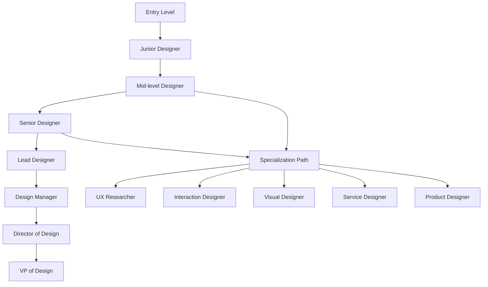

# UI/UX Career Path: From Beginner to Expert

A comprehensive guide to building a successful career in UI/UX design, including roles, skills, and progression paths.

## Career Progression Overview

## Entry Level Positions

### Junior UI Designer
**Responsibilities:**
- Create visual designs for digital products
- Work with established design systems
- Collaborate with senior designers
- Execute design tasks with guidance

**Required Skills:**
- Basic proficiency in design tools (Figma, Sketch, Adobe XD)
- Understanding of design principles
- Basic knowledge of color theory and typography
- Ability to receive and implement feedback

**Typical Salary Range:** $45,000 - $65,000

### Junior UX Designer
**Responsibilities:**
- Support user research activities
- Create basic wireframes and prototypes
- Participate in usability testing
- Assist with user journey mapping

**Required Skills:**
- Understanding of UX principles
- Basic research methodologies
- Wireframing skills
- Empathy and user-centered thinking

**Typical Salary Range:** $50,000 - $70,000

### UI/UX Intern
**Responsibilities:**
- Shadow senior designers
- Complete assigned design tasks
- Participate in team meetings
- Learn company processes and tools

**Required Skills:**
- Design school or self-taught skills
- Portfolio demonstrating basic skills
- Strong desire to learn
- Good communication skills

**Typical Salary Range:** $20 - $30/hour

## Mid-Level Positions

### UI Designer
**Responsibilities:**
- Lead visual design for products
- Create and maintain design systems
- Mentor junior designers
- Collaborate with product teams

**Required Skills:**
- Advanced proficiency in design tools
- Strong visual design skills
- Understanding of brand guidelines
- Ability to create design systems

**Typical Salary Range:** $70,000 - $95,000

### UX Designer
**Responsibilities:**
- Plan and conduct user research
- Design end-to-end user experiences
- Create detailed user journey maps
- Lead usability testing sessions

**Required Skills:**
- Strong research and analytical skills
- Proficiency in prototyping tools
- Understanding of information architecture
- Excellent communication and presentation skills

**Typical Salary Range:** $75,000 - $100,000

### Product Designer
**Responsibilities:**
- End-to-end product design
- Collaborate with cross-functional teams
- Define product requirements
- Measure and optimize product performance

**Required Skills:**
- Combination of UI and UX skills
- Understanding of product management
- Data analysis capabilities
- Strategic thinking

**Typical Salary Range:** $80,000 - $110,000

## Senior Positions

### Senior UI/UX Designer
**Responsibilities:**
- Lead complex design projects
- Define design strategy and direction
- Mentor and coach team members
- Present to executives and stakeholders

**Required Skills:**
- Expert-level design skills
- Strong leadership abilities
- Strategic thinking and planning
- Excellent stakeholder management

**Typical Salary Range:** $100,000 - $140,000

### Design Lead
**Responsibilities:**
- Manage a team of designers
- Set team goals and priorities
- Ensure design quality and consistency
- Represent design in company strategy

**Required Skills:**
- Proven leadership experience
- Strong people management skills
- Strategic vision
- Excellent communication skills

**Typical Salary Range:** $120,000 - $160,000

## Management Positions

### Design Manager
**Responsibilities:**
- Build and scale design teams
- Develop design processes and practices
- Manage budgets and resources
- Align design with business objectives

**Required Skills:**
- Extensive management experience
- Business acumen
- Talent development skills
- Organizational leadership

**Typical Salary Range:** $140,000 - $180,000

### Director of Design
**Responsibilities:**
- Lead design strategy for entire organization
- Partner with executive team
- Drive design innovation
- Manage multiple design teams

**Required Skills:**
- Executive leadership experience
- Strategic business thinking
- Change management skills
- Industry expertise

**Typical Salary Range:** $160,000 - $250,000

### VP of Design
**Responsibilities:**
- Set design vision for company
- Influence product and business strategy
- Represent company in industry
- Drive design culture transformation

**Required Skills:**
- C-level executive experience
- Industry thought leadership
- Board-level communication skills
- Visionary thinking

**Typical Salary Range:** $250,000+

## Specialization Paths

### UX Researcher
**Focus Areas:**
- User behavior analysis
- Research methodology
- Data interpretation
- Insights generation

**Career Progression:**
- Junior Researcher → Senior Researcher → Lead Researcher → Research Manager

### Interaction Designer
**Focus Areas:**
- Micro-interactions
- Animation design
- Interface behavior
- User flows

**Career Progression:**
- Junior Interaction Designer → Interaction Designer → Senior Interaction Designer → Interaction Design Lead

### Visual Designer
**Focus Areas:**
- Brand identity
- Illustration
- Motion design
- Art direction

**Career Progression:**
- Junior Visual Designer → Visual Designer → Senior Visual Designer → Art Director

### Service Designer
**Focus Areas:**
- End-to-end service experiences
- Touchpoint orchestration
- Organizational design
- Customer journey optimization

**Career Progression:**
- Service Designer → Senior Service Designer → Service Design Lead → Service Design Director

### Product Designer
**Focus Areas:**
- Product strategy
- Business requirements
- Technical feasibility
- Market analysis

**Career Progression:**
- Product Designer → Senior Product Designer → Product Design Lead → Head of Product Design

## Skills Development Roadmap

### Year 1: Foundation
- Master design tools
- Build portfolio
- Learn design principles
- Understand UX process

### Year 2-3: Growth
- Lead small projects
- Develop specialization
- Improve stakeholder skills
- Begin mentoring others

### Year 4-6: Leadership
- Lead complex initiatives
- Develop strategic thinking
- Mentor junior team members
- Contribute to design culture

### Year 7+: Executive
- Drive organizational change
- Influence industry direction
- Develop thought leadership
- Build and scale teams

## Certification and Education

### Industry Certifications
1. **Google UX Design Certificate** (Coursera)
2. **Nielsen Norman Group UX Certification**
3. **Adobe Certified Expert**
4. **Interaction Design Foundation Certificates**

### Academic Programs
1. **Master's in Human-Computer Interaction**
2. **Master's in Design**
3. **Master's in Information Science**
4. **Bachelor's in Graphic Design**

### Self-Directed Learning
1. **Online courses** (Udemy, Coursera, LinkedIn Learning)
2. **Design challenges** (Daily UI, Design Challenges)
3. **Reading** (Books, blogs, research papers)
4. **Community participation** (Meetups, conferences)

## Networking and Community

### Professional Organizations
1. **Interaction Design Association (IxDA)**
2. **User Experience Professionals Association (UXPA)**
3. **American Institute of Graphic Arts (AIGA)**
4. **Design Systems Coalition**

### Conferences
1. **UXPA International Conference**
2. **Interaction Conference**
3. **Smashing Conference**
4. **Design Systems Coalition Events**

### Online Communities
1. **Dribbble**
2. **Behance**
3. **Designer Hangout (Slack)**
4. **UX Design.cc (Medium)**

## Portfolio Development

### Essential Portfolio Elements
1. **Case Studies** - Detailed project breakdowns
2. **Process Documentation** - Show your thinking
3. **Before/After Examples** - Demonstrate impact
4. **Diverse Projects** - Show range of skills

### Portfolio Platforms
1. **Personal Website** - Full control and customization
2. **Behance** - Adobe's portfolio platform
3. **Dribbble** - Design community focus
4. **GitHub Pages** - Free hosting option

## Job Search Strategy

### Preparation
1. **Resume Optimization** - Highlight relevant skills
2. **Portfolio Development** - Quality over quantity
3. **Network Building** - Connect with industry professionals
4. **Interview Preparation** - Practice design exercises

### Application Process
1. **Tailored Applications** - Customize for each role
2. **Follow-up** - Professional communication
3. **Interview Process** - Prepare for multiple rounds
4. **Negotiation** - Understand your worth

## Salary Negotiation

### Research
1. **Market Rates** - Understand industry standards
2. **Company Size** - Larger companies often pay more
3. **Location Factors** - Cost of living variations
4. **Experience Level** - Know your worth

### Negotiation Tips
1. **Know Your Range** - Minimum acceptable and ideal
2. **Consider Total Package** - Benefits, equity, flexibility
3. **Be Confident** - Present your value clearly
4. **Practice** - Rehearse negotiation conversations

## Work-Life Balance

### Remote Work Considerations
1. **Communication Tools** - Master collaboration platforms
2. **Time Management** - Establish boundaries
3. **Self-Motivation** - Stay productive independently
4. **Team Connection** - Maintain relationships

### Freelance Opportunities
1. **Client Management** - Set expectations clearly
2. **Project Scoping** - Define deliverables accurately
3. **Financial Planning** - Manage irregular income
4. **Legal Considerations** - Contracts and insurance

## Future Trends

### Emerging Skills
1. **Voice User Interfaces** - Designing for voice interactions
2. **AR/VR Design** - Immersive experience design
3. **AI-Enhanced UX** - Intelligent interfaces
4. **Accessibility Expertise** - Inclusive design mastery

### Industry Evolution
1. **Design Systems Maturity** - Component-driven development
2. **Data-Driven Design** - Analytics integration
3. **Cross-Platform Design** - Unified experiences
4. **Ethical Design** - Privacy and responsibility focus

---
*This career path document is part of the UI/UX Developer Guide. For more information, visit [the main guide](../README.md).*