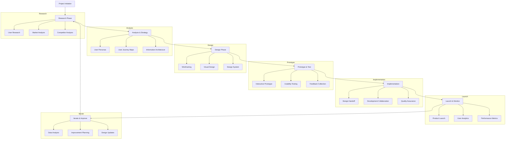

# UI/UX Design Workflow

A comprehensive guide to the end-to-end UI/UX design process.

## Complete Design Process Flowchart

## Phase 1: Project Initiation

### Key Activities
1. **Project Brief Development**
   - Define project goals and objectives
   - Identify stakeholders
   - Establish timeline and budget
   - Determine success metrics

2. **Team Assembly**
   - Assign roles and responsibilities
   - Establish communication channels
   - Set up collaboration tools

3. **Initial Discovery**
   - Understand business requirements
   - Identify target audience
   - Review existing products or services

### Deliverables
- Project charter
- Stakeholder map
- Initial timeline
- Resource allocation plan

## Phase 2: Research Phase

### User Research
1. **Qualitative Research**
   - User interviews
   - Contextual inquiries
   - Focus groups
   - Ethnographic studies

2. **Quantitative Research**
   - Surveys and questionnaires
   - Analytics review
   - A/B testing
   - Statistical analysis

### Market Analysis
1. **Industry Research**
   - Market size and trends
   - Growth projections
   - Regulatory environment

2. **Competitive Analysis**
   - Direct competitors
   - Indirect competitors
   - Market positioning
   - SWOT analysis

### Deliverables
- Research report
- User research findings
- Competitive analysis document
- Market analysis summary

## Phase 3: Analysis & Strategy

### User Personas
1. **Persona Development**
   - Demographic information
   - Behavioral patterns
   - Goals and motivations
   - Pain points and challenges

2. **Persona Validation**
   - Stakeholder review
   - User validation
   - Iteration based on feedback

### User Journey Mapping
1. **Current State Mapping**
   - Existing user experiences
   - Pain points identification
   - Opportunity areas

2. **Future State Mapping**
   - Ideal user experiences
   - Touchpoint optimization
   - Service blueprint development

### Information Architecture
1. **Content Strategy**
   - Content audit
   - Taxonomy development
   - Content hierarchy

2. **Navigation Design**
   - Site map creation
   - Menu structures
   - Search functionality

### Deliverables
- User personas document
- User journey maps
- Information architecture blueprint
- Content strategy framework

## Phase 4: Design Phase

### Wireframing
1. **Low-Fidelity Wireframes**
   - Paper prototypes
   - Basic layout exploration
   - Concept validation

2. **Mid-Fidelity Wireframes**
   - Digital wireframes
   - Interaction flow definition
   - Content placement

3. **High-Fidelity Wireframes**
   - Detailed layout specifications
   - Component definitions
   - Annotation documentation

### Visual Design
1. **Design Exploration**
   - Mood boards
   - Style tiles
   - Visual concept development

2. **Design Refinement**
   - Color palette selection
   - Typography system
   - Iconography development

3. **Final Design**
   - High-fidelity mockups
   - Responsive design specifications
   - Design documentation

### Design System
1. **Component Library**
   - UI component definitions
   - Interaction specifications
   - Usage guidelines

2. **Style Guide**
   - Visual standards
   - Brand application
   - Accessibility guidelines

### Deliverables
- Wireframe sets (low, mid, high-fidelity)
- Visual design mockups
- Design system documentation
- Style guide

## Phase 5: Prototype & Test

### Interactive Prototype
1. **Prototype Development**
   - Tool selection (Figma, InVision, etc.)
   - Interaction design
   - Navigation flow implementation

2. **Prototype Refinement**
   - User flow optimization
   - Micro-interaction design
   - Content integration

### Usability Testing
1. **Test Planning**
   - Test scenario development
   - Participant recruitment
   - Test environment setup

2. **Test Execution**
   - Moderated testing sessions
   - Unmoderated remote testing
   - A/B testing implementation

3. **Data Collection**
   - Observation notes
   - Video recordings
   - Performance metrics

### Feedback Collection
1. **Stakeholder Review**
   - Internal feedback sessions
   - Executive review
   - Iteration planning

2. **User Feedback**
   - User testing sessions
   - Survey distribution
   - Interview conduct

### Deliverables
- Interactive prototype
- Usability test report
- Feedback analysis document
- Iteration recommendations

## Phase 6: Implementation

### Design Handoff
1. **Asset Preparation**
   - Export specifications
   - Asset organization
   - File naming conventions

2. **Documentation**
   - Design specifications
   - Interaction guidelines
   - Responsive design notes

3. **Tool Integration**
   - Zeplin/Avocode setup
   - Design system integration
   - Developer collaboration

### Development Collaboration
1. **Development Support**
   - Front-end development assistance
   - Component implementation guidance
   - Issue resolution

2. **Quality Assurance**
   - Design QA process
   - Cross-browser testing
   - Device compatibility verification

### Deliverables
- Design handoff package
- Developer documentation
- Implementation guidelines
- QA checklist

## Phase 7: Launch & Monitor

### Product Launch
1. **Launch Preparation**
   - Final testing
   - Content population
   - Stakeholder training

2. **Go-Live Support**
   - Launch day support
   - Issue monitoring
   - Quick response procedures

### User Analytics
1. **Analytics Setup**
   - Tool configuration (Google Analytics, etc.)
   - Event tracking implementation
   - Conversion funnel setup

2. **Data Collection**
   - User behavior tracking
   - Performance metrics monitoring
   - Custom reporting

### Performance Metrics
1. **Success Metrics**
   - KPI tracking
   - Goal completion rates
   - User satisfaction scores

2. **Performance Monitoring**
   - Load time optimization
   - Error rate monitoring
   - User retention analysis

### Deliverables
- Launch success report
- Analytics dashboard
- Performance metrics report
- User feedback summary

## Phase 8: Iterate & Improve

### Data Analysis
1. **Quantitative Analysis**
   - Usage pattern identification
   - Performance metric evaluation
   - Conversion optimization

2. **Qualitative Analysis**
   - User feedback review
   - Support ticket analysis
   - Interview insights

### Improvement Planning
1. **Opportunity Identification**
   - Pain point prioritization
   - Feature enhancement planning
   - New functionality exploration

2. **Roadmap Development**
   - Prioritization framework
   - Timeline planning
   - Resource allocation

### Design Updates
1. **Iterative Design**
   - Continuous improvement cycles
   - A/B testing implementation
   - User experience optimization

2. **Major Updates**
   - Redesign initiatives
   - Platform expansion
   - Technology upgrades

### Deliverables
- Improvement roadmap
- Iteration plan
- Updated design assets
- Performance optimization report

---
*This workflow document is part of the UI/UX Developer Guide. For more information, visit [the main guide](../README.md).*